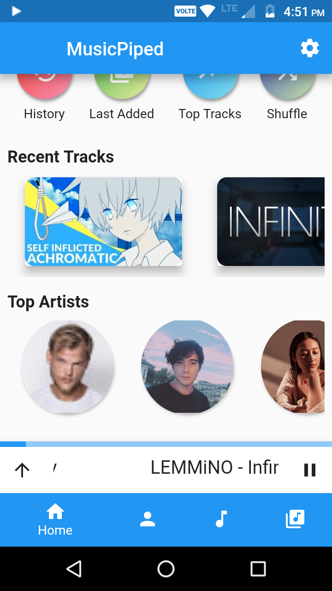
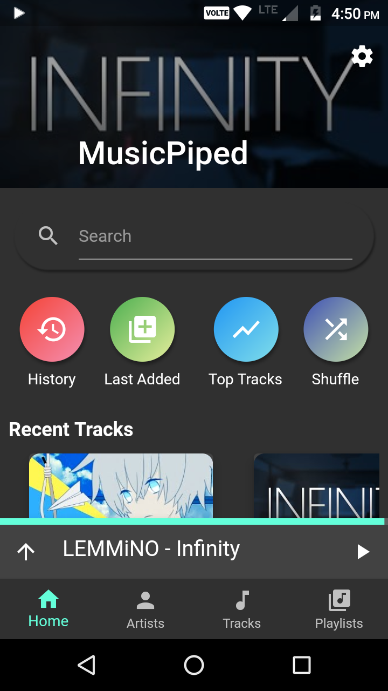
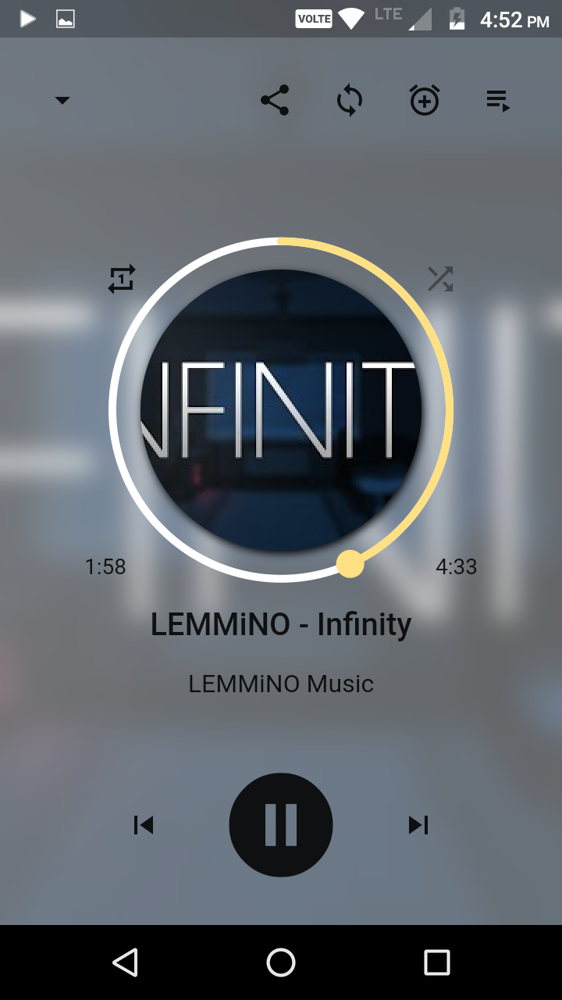
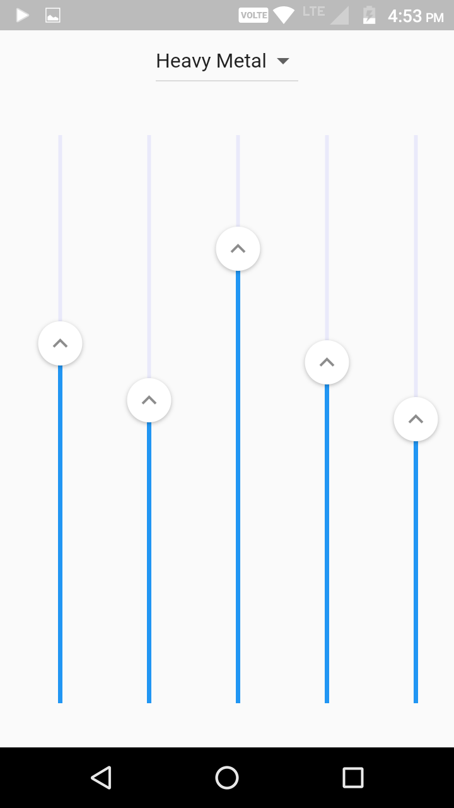
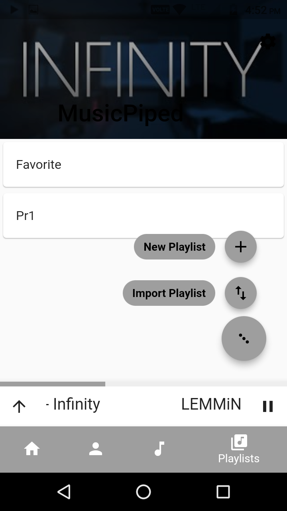
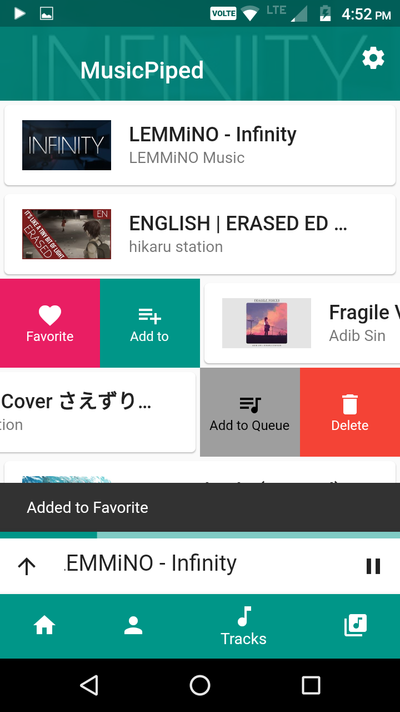
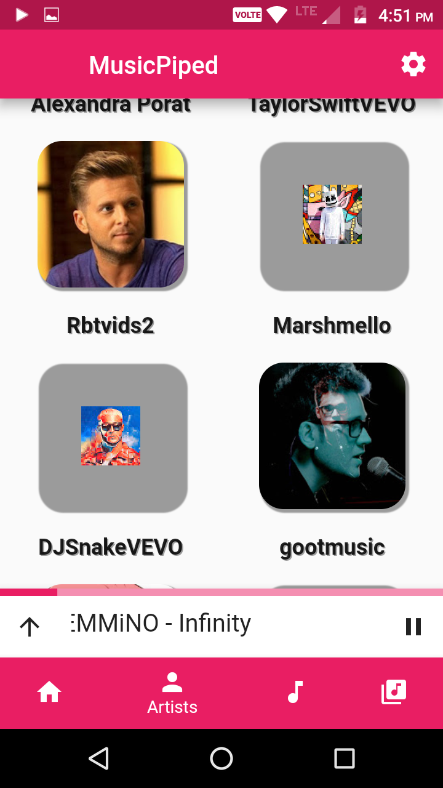

 
<h2 align="center"><b>NewPipe</b></h2>
<h4 align="center">A libre lightweight streaming frontend for Android.</h4>

 

## Screenshots

## Description

MusicPiped is a materialistic designed music player. It tries to be a music player that instead of playing music from local files streams them from YouTube. It is similar to YouTube Music in sense that it searches and plays from YouTube. But different in way that it does not lists any track by itself and user needs to either add their track from youtube by searching or importing playlist (similar to adding music in a music player). It also does not uses any Google APIs thus is independent of google services and can work without them, allowing background playback and no ads.

Each Music played only downloads/streams the audio from youtube thus saves the large data usage of video, also every music played is cached thus playing again does not require internet connection.

### Features

* Search Youtube
* Background Playback
* Notification Control
* Audio Only Streaming
* AutoPlay Recommended (sync icon in playback screen)
* Material design
* Automatic cache management
* Import YouTube Playlist
* Custom Playlist
* General Music Player features (Shuffle,Repeat etc)
* Autogenerated Top Tracks, History/Last Played, etc
* No unnecessary permission (just INTERNET)

### Coming Features

* Import/Export Playlist to file
* Region trending/popular music tab
* suggest more...

## Donate
Donation of any kind is appreciated :)

<table>
  <tr>
    <td></td>
    <td></td>
    <td><a href="https://www.buymeacoffee.com/deepgaurav">Donate with buymeacofee</a></td>
  </tr>
  <tr>
    <td></td>
    <td></td>
    <td><a href="https://paypal.me/deepgaurav">Paypal Me!</a></td>
  </tr>
</table>

## Privacy Policy

MusicPiped is commited to keep user data secure and so does not collect any form of data from user and does not require any device permissions except for INTERNET. Please read the [Privacy Policy document](Privacy.md)

## License
  

MusicPiped is Free Software: You can use, study share and improve it at your
will. Specifically you can redistribute and/or modify it under the terms of the
[GNU General Public License](https://www.gnu.org/licenses/gpl.html) as
published by the Free Software Foundation, either version 3 of the License, or
(at your option) any later version.  
